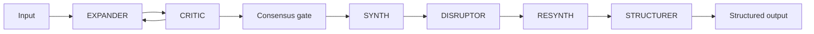

# iARTS

### Iterative Adversarial Reasoning Transmutation System

*iARTS takes a 2D prompt and expands it into a multidimensional reasoning space.*

> *It is not a multi-agent tool. It is not a conventional pipeline.*  
> *It is a **cognition engine** that transforms ideas through structured conflict,*  
> *until only what can withstand constraint remains.*  
> *Deterministic orchestration with enforced epistemology.*

---

## What this is

Most AI systems **generate answers**.

**iARTS** runs ideas through **iterative adversarial transmutation**: expand, attack, synthesize, disrupt, reintegrate, distill. What exits is not a summary, not a blend of opinions, and not a polite refinement of the prompt — it is whatever **still holds** after enforced scrutiny.

**REFUSED** is not a failure mode. It is the correct output when the premise, context, or plan cannot be validated.

The difference is not “which model.” It is **architecture and epistemology**.

---

## How it is different

| Approach | What it does |
|----------|----------------|
| **Fusion-style fusion** | Combines outputs and picks a winner |
| **Fugu-style orchestration** | Routes and blends reasoning across models |
| **iARTS** | **Enforces** conflict, gates, and structured decisions — no silent degradation, no “best effort” substitute for a broken premise |

Either the idea survives scrutiny — or the system says so explicitly.

---

## The six agents (roles only)

One closed loop. Single responsibility per stage. No stage “helps” by agreeing.

| Agent | Role |
|-------|------|
| **EXPANDER** | Forces the input open — angles, framings, unstated assumptions |
| **CRITIC** | Attacks the weakest points; invalidates what does not hold |
| **SYNTH** | Integrates what survived into a concrete plan |
| **DISRUPTOR** | Never accepts the plan as-is; **DESTROY**, **LIFE**, or **RENEW** |
| **RESYNTH** | Surgical integration of disruption — signal, not noise |
| **STRUCTURER** | One artifact: **GOAL · STRATEGY · RISKS · ASSUMPTIONS · DECISION** |

Human **checkpoints** sit on the path (continue, revise, another round, correction) so automation cannot smuggle through unexamined consensus.



*Diagram shows logic, not implementation. Prompts, orchestration code, and production presets are not published in this repository.*

---

## What this repository contains

This public repository is the **face of the project**: definition, principles, and license.

| Public here | Not public (separate development) |
|-------------|-----------------------------------|
| Concept, agent roles, design principles | Full engine, prompts, and presets |
| Status and roadmap | Production UI, API, and hardware tuning |
| Contact and collaboration | Benchmarks, customer-specific doctrine |

**Source code is not open-sourced in this repo.** Early access, research collaboration, and product pilots are available on request.

---

## Status

| | |
|---|---|
| **State** | Operational — local-first production stack |
| **First production run** | 2026-05-29 |
| **Version** | v1.2.0 |
| **Public README** | 2026-06-27 |
| **Built by** | [Deltaworks](https://deltaworks.it) |

Runs today on **local inference** (no requirement to send your prompt to a vendor for the core loop). Deployments are **model-agnostic** at the design level: the engine defines *roles and gates*, not a single vendor lock-in.

---

## Roadmap (public)

1. **iARTS Lite** — stripped loop (fewer agents / rounds), smaller or user-supplied models, suitable for demos and education  
2. **Cloud-backed iARTS** — same cognition engine; **your** API keys and providers (orchestration without replacing the adversarial structure)  
3. **Research notes** — method and outcomes, not proprietary prompt packs  

---

## Context dependency

> Wrong context → wrong reality → perfect reasoning → wrong answer

iARTS does not oracle truths. It **stress-tests what you supply**. Before blaming the engine, verify architecture description, constraints, dead ends already tried, and whether the question itself is well-formed.

---

## Place in the Deltaworks stack

```
iARTS    — Cognition      — multidimensionalize and transmute a prompt
ASR3AL   — Representation — compress the considered result
ASRE4L   — Trust          — secure representation for transport
Mode AB  — Execution      — deterministic run on what survived
```

---

## Credibility (selected outcomes, anonymized)

- **Production run (2026-05-29)** — Full six-stage loop completed; STRUCTURER output included conclusions not present verbatim in the input (transmutation, not paraphrase).  
- **Context failure (2026-05-29)** — Incomplete doctrine → wrong question answered well; drove explicit **REFUSED** / context rules.  
- **Dual-stack run (2026-06-19)** — End-to-end loop with tiered disruptor behavior and resident structuring stage validated under local hardware constraints.

Detailed traces and reproducible packs are shared under **NDA / beta**, not in this README.

---

## Contact

- **Web:** [deltaworks.it](https://deltaworks.it)  
- **Email:** hi@deltaworks.it  

For **demo access**, **Lite preview**, or **research collaboration**, include a one-line problem domain and whether you need local-only or cloud-backed orchestration.

---

## License

This repository is licensed under **[CC BY-NC-ND 4.0](https://creativecommons.org/licenses/by-nc-nd/4.0/)** (Attribution · NonCommercial · NoDerivatives). You may share this README and LICENSE with credit; commercial use and modified redistribution require written permission from Deltaworks. Full terms: [LICENSE](./LICENSE).

---

*The six agents are wise only when the doctrine that feeds them is whole.*

**Deltaworks** · iARTS · v1.2.0 · 2026-06-27
